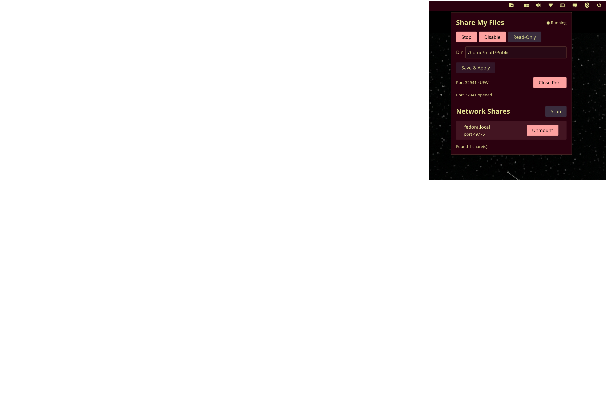

# cosmic-share-browser

A COSMIC desktop panel applet for sharing files over WebDAV and browsing network shares via Avahi/mDNS.



## What it does

**Share files** — Exposes a directory (default `~/Public`) as a WebDAV server on your local network, advertised via Avahi so other machines can discover it automatically. Defaults to read-only; read-write can be enabled with a toggle.

**Browse shares** — Discovers WebDAV shares on the LAN via mDNS and lets you mount/unmount them with one click using `gio`.

The applet lives in your COSMIC panel. A background daemon (`cosmic-share-daemon`) handles the actual WebDAV serving as a systemd user service.

## Features

- Read-only by default, read-write toggle in the applet
- Ephemeral port assignment (OS picks a free port each start)
- Automatic firewall management (UFW, firewalld, nftables, iptables)
- Stale firewall rule cleanup across reboots (single password prompt)
- Local share filtering (your own machine is hidden from the browse list)
- Avahi service advertisement (`_webdav._tcp`)
- Config hot-reload (daemon polls every 3 seconds)

## Dependencies

- [COSMIC desktop](https://github.com/pop-os/cosmic-epoch) with panel
- [Avahi](https://avahi.org/) — `avahi-daemon`, `avahi-browse`, `avahi-publish-service`
- `gio` (GLib/GVFS) — for mounting discovered shares
- A firewall (optional) — UFW, firewalld, nftables, or iptables

### Build dependencies

- Rust (stable)
- `just` (command runner)
- libcosmic development headers (pulled via git dep in Cargo.toml)

## Install

```sh
git clone https://github.com/ctsdownloads/cosmic-share-browser.git
cd cosmic-share-browser
just install
```

This builds both binaries, copies them to `~/.local/bin/`, installs the `.desktop` file, and reloads systemd.

### Add the applet

Settings → Desktop → Panel → click **+** to add an applet → select **Network Share Browser** → drag it to the end (right) section of the panel.

### First run

Click the applet icon. It will show "Service not installed" — click **Install & Start Sharing Service**. This creates the systemd user service, enables and starts the daemon.

## Usage

Click the panel icon to open the popup.

**Sharing:** Click "Enable" to start sharing. The daemon binds a random port, writes it to a port file, and advertises via Avahi. Click "Open Port" to open the firewall (one password prompt). Change the shared directory and click "Save & Apply" to restart the daemon with the new path.

**Read-only / Read-write:** The share defaults to read-only. Click "Read-Only" to toggle to read-write — the button turns red to indicate write access is enabled. The daemon restarts automatically. When read-only, PUT, DELETE, MKCOL, MOVE, COPY, PROPPATCH, LOCK, and UNLOCK requests are rejected with 405 Method Not Allowed.

**Browsing:** The applet scans for `_webdav._tcp` services on the network automatically. Click "Mount" to mount a share via `gio mount`, or "Unmount" to remove it. Click "Scan" to refresh.

## How it works

The project has three components:

| Component | Binary | Role |
|---|---|---|
| Applet (GUI) | `cosmic-share-browser` | Panel icon + popup controls |
| Daemon | `cosmic-share-daemon` | WebDAV server + Avahi advertisement |
| Library | `cosmic_share_browser` | Shared config and firewall logic |

The daemon runs as `~/.config/systemd/user/cosmic-share-daemon.service`. It reads `~/.config/cosmic-share-browser/config.toml` and re-checks every 3 seconds for changes. When sharing is enabled, it binds an ephemeral port, writes the port number to `$XDG_RUNTIME_DIR/cosmic-share-daemon.port`, and starts a WebDAV server using `dav-server` + `hyper`.

The applet reads the port file to display the current port and manage firewall rules via `pkexec`. On startup it cleans up stale firewall rules from previous sessions and opens the new port in a single password prompt.

## Configuration

`~/.config/cosmic-share-browser/config.toml`:

```toml
enabled = true
shared_dir = "/home/user/Public"
service_name = "COSMIC-Share"
read_only = true
```

## Security

- **No authentication.** Anyone on the LAN can access the shared directory. This is the same model as macOS Public folder sharing or Samba guest access.
- **Read-only by default.** Write access requires an explicit toggle.
- **Write-method blocking** happens at the HTTP layer before the request reaches the WebDAV handler.
- **Firewall rules** are ephemeral — they auto-clean on reboot. The applet tracks the last opened port and cleans up stale rules on startup.

## Uninstall

```sh
just uninstall
```

Remove the applet from the panel in Settings → Desktop → Panel.

## License

GPL-3.0
